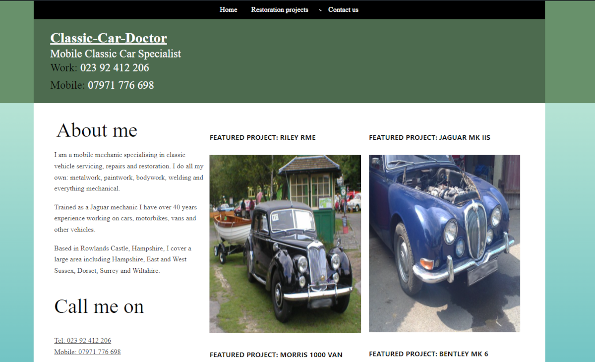

# ccd2022 

* Contributors: bobbingwide
* Donate link: https://www.oik-plugins.com/oik/oik-donate/
* Tags: blocks, FSE, Gutenberg, Full Site Editing
* Requires at least: 5.9
* Tested up to: 5.9
* Version: 0.0.0
* License: GPLv2 or later
* License URI: http://www.gnu.org/licenses/gpl-2.0.html

Classic Car Doctor Full Site Editing theme for 2022

## Description 
Replacement theme for classic-car-doctor.com.
The ccd2022 theme replaces the ccd0515 theme which was developed using Artisteer v4.1 in 2015.

Requirements:

1. Implement Full Site Editing
2. Similar look and feel as classic-car-doctor, originally
3. Minimal PHP and CSS
4. Partly completed theme.json
5. Templates and template parts to be provided
6. Use block plugins for functionality not yet supported
7. or shortcodes when blocks are not yet available.
8. Should look and feel the same with Gutenberg 12.3.* or above activated.

* ### Contents: 

IMPLEMENTED:

The `block-templates` developed so far are:

* index.html -
* page.html -
* home.html -

The `block-template-parts` are:

* content.html
* footer.html
* header.html

ASSETS:
Some parts of this theme were copied from Twenty Twenty-Two including the SourceSerif4Variable font files

## Installation 

* Install WordPress 5.9
* Install the ccd2022 theme
* Activate the theme
* Update each page to use blocks rather than shortcodes

## Change Log 

# 0.0.0 
* Added: All the files to display the index.html page
* Tested: With WordPress 5.9-RC2
* Tested: With PHP 8.0

## Brief development history 

- ccd2022 is my sixth FSE theme.
- I developed it in an afternoon using the (Site) Editor beta delivered in WordPress 5.9-RC2.
- The background colours and gradients are a bit ugly.
- But no worse or better than the original Artisteer theme.
- It currently looks different with Gutenberg 12.3.2
- This is due to changes to the template parts attributes supported by Gutenberg.

## Copyright 
(C) Copyright Herb Miller, Bobbing Wide 2022

* This program is free software: you can redistribute it and/or modify
it under the terms of the GNU General Public License as published by
the Free Software Foundation, either version 2 of the License, or
(at your option) any later version.

This program is distributed in the hope that it will be useful,
but WITHOUT ANY WARRANTY; without even the implied warranty of
MERCHANTABILITY or FITNESS FOR A PARTICULAR PURPOSE. See the
GNU General Public License for more details.
